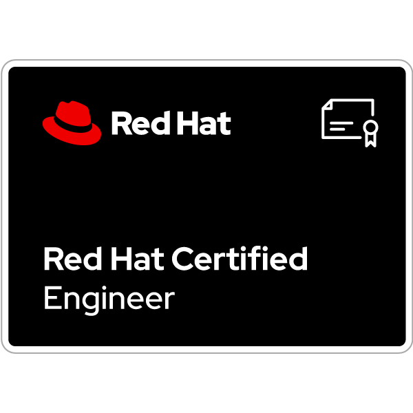

# Readme
# 

 

  I'm Minwoo, a <b>RedHat Linux Expert</b> ✨
  
  My passion is to create high-performance, reliable infrastructure that provides a <b>stable foundation</b> ⚡ for systems.  
  Whether I'm managing a single server or working on a complex enterprise infrastructure,  
  I always strive 🔥 for the best possible system performance and security.

<h2 align="center">🏆 Professional Certifications</h2>

  &nbsp;&nbsp;
  &nbsp;&nbsp;
  

